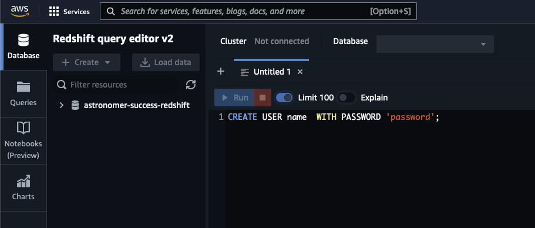
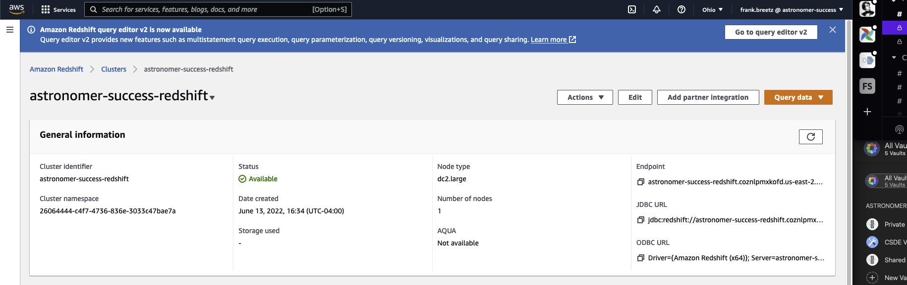

### Module - Redshift Connection + Operators

**Before you Start**

- Have a Redshift Database with existing data
- Ensure that Astronomer Cloud has network access to the Database
- Have a Redshift User with existing Credentials

**Gather Credentials**

- [ ]  Create a new Redshift Database User

    

- [ ]  Obtain the Endpoint

    

    It will be in the form `{Host}:{Port}/{Schema}`


**Create Connection and Test with DAG**

- [ ]  Create a connection in one of the following ways:
    - Add a MySQL Connection in your Dockerfile, a Secrets Backend, or via [Env Variables](https://docs.astronomer.io/astro/environment-variables)

        ```bash
        export AIRFLOW_CONN_REDSHIFT_DEFAULT='redshift://<USERNAME>:<PASSWORD>@<HOST>:<PORT>/<SCHEMA>
        ```

    - **OR** go to Admin > Connections in the Airflow UI, fill in `Connection ID` field (`redshift_default`), select `Redshift` as a connection type, and fill in the following fields (leave all other fields as their default value or blank):

        ```yaml
        Connection Id: redshift_default
        Connection Type: Redshift
        Host: <HOST>
        Schema: <Schema>
        Login: <USERNAME>
        Password: <PASSWORD>
        Port: <PORT>
        ```

    - For more information on snowflake connection in Airflow, be sure to review the Airflow OSS documentation

        [Amazon Redshift Connection - apache-airflow-providers-amazon Documentation](https://airflow.apache.org/docs/apache-airflow-providers-amazon/stable/connections/redshift.html)


**Add the example DAG to your project**

- [ ]  Create the following as `dags/example_redshift.py` and run the DAG in the Airflow UI locally and in Astronomer Cloud

    ```python
    from datetime import datetime
    from airflow import DAG
    from airflow.providers.amazon.aws.operators.redshift_sql import RedshiftSQLOperator

    with DAG(
        dag_id="example_redshift",
        start_date=datetime(2021, 1, 1),
        schedule=None
    ) as dag:
        RedshiftSQLOperator(
    				redshift_conn_id='redshift_default',
            sql=f'SELECT 1;',
            task_id='test_redshift',
        )
    ```


**Checkpoint**

You now have

- tested the Redshift connection in Airflow
- and have utilized the `RedShiftSQLOperator`

**Next Steps**

- Integrate the new Airflow Connection with your Use Case Workload
- [Review other Redshift Operators](https://registry.astronomer.io/modules/?query=RedShift&page=1) in the Astronomer Registry
- Reference


    ### Redshift

    Operators/Components:

    - [AwsRedshiftClusterSensor | Astronomer Registry](https://registry.astronomer.io/providers/amazon/modules/awsredshiftclustersensor)
    - [RedshiftClusterSensor | Astronomer Registry](https://registry.astronomer.io/providers/amazon/modules/redshiftclustersensor)
    - [RedshfitPauseClusterOperator | Astronomer Registry](https://registry.astronomer.io/providers/amazon/modules/redshiftpauseclusteroperator)
    - [RedshiftResumeClusterOperator | Astronomer Registry](https://registry.astronomer.io/providers/amazon/modules/redshiftresumeclusteroperator)
    - [RedshiftSQLOperator | Astronomer Registry](https://registry.astronomer.io/providers/amazon/modules/redshiftsqloperator)
    - [RedshiftToS3Operator | Astronomer Registry](https://registry.astronomer.io/providers/amazon/modules/redshifttos3operator)
    - [S3ToRedshiftOperator | Astronomer Registry](https://registry.astronomer.io/providers/amazon/modules/s3toredshiftoperator)

    GitHub POC:

    - [cs-tutorial-redshift | GitHub](https://github.com/astronomer/cs-tutorial-redshift)

    Astronomer Guide:

    - [Orchestrating Redshift Operations from Airflow | Astronomer Guide](https://www.astronomer.io/guides/airflow-redshift)
