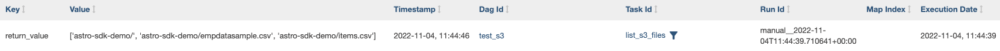

### Module - AWS S3 Connection + Operators

**Before You Start**

- [ ]  Log in to AWS Console

**IAM User AWS Connection**

- [ ]  [Create an IAM user](https://docs.aws.amazon.com/IAM/latest/UserGuide/id_users_create.html) (or use an existing one) - choose `Access key - Programmatic access` as AWS Access Type
- [ ]  Save `Access key ID` and `Secret access key`
- [ ]  Create a connection in one of the following ways:
- [Add an AWS Connection](https://airflow.apache.org/docs/apache-airflow-providers-amazon/stable/connections/aws.html) in your Dockerfile, a Secrets Backend, or via [Env Variables](https://docs.astronomer.io/astro/environment-variables)

```docker
export AIRFLOW_CONN_AWS_DEFAULT=aws://_your_aws_access_key_id_:_your_aws_secret_access_key_@
```

- **OR** Go to Admin > Connections in the Airflow UI, fill in `Connection ID` field (`aws_default`), select `Amazon S3` as a connection type, in the `Extra` field add:

```jsx
{"aws_access_key_id":"_your_aws_access_key_id_", "aws_secret_access_key": "_your_aws_secret_access_key_"}
```

<aside>
💡 If you are running Airflow locally and chose the first way to create a connection, you’ll need to restart the project. You can restart your project using `astro dev restart`.

</aside>

**Use S3ListOperator**

- [ ]  Test out an S3 operator
- Create the following DAG (add `test_s3.py` file to your `dags` directory)

```python
import pendulum
from datetime import timedelta

from airflow import DAG
from airflow.providers.amazon.aws.operators.s3 import S3ListOperator

# To be changed accordingly
S3_CONN_ID = 'aws_default'
S3_BUCKET_NAME = 'astro-onboarding'
S3_PREFIX = 'astro-sdk-demo/'

with DAG(dag_id='test_s3',
         start_date=pendulum.datetime(2022, 11, 1, tz="UTC"),
         schedule=None,
		     ):

	list_s3_files = S3ListOperator(
	    task_id='list_s3_files',
	    bucket=S3_BUCKET_NAME,  # The S3 bucket where to find the objects
	    prefix=S3_PREFIX,  # Prefix string to filters the objects whose name begin with such prefix
	    delimiter='/',  # The delimiter marks key hierarchy
	    aws_conn_id=S3_CONN_ID,
	)
```

- Run it locally or deploy to Astro and hit the ▶️ `Trigger DAG` button to see a successful run
- [ ]  Navigate to `Admin -> XComs`, you should see all objects from the bucket with the given string prefix in name saved as an XCom



**Checkpoint**

At this point you should:

- Have a working AWS connection
- Run an example task successfully in the DAG and see expected objects list saved as an XCom

**Next Steps**

- You can look into [other S3 Operators](https://registry.astronomer.io/modules?query=s3&page=1&types=Operators%2CSensors%2CTransfers) or the [S3Hook](https://registry.astronomer.io/providers/amazon/modules/s3hook) to conduct more advanced functionality

**Extras / Reference**

- Reference


    ### S3

    - [Amazon Web Services Connection | Airflow OSS Doc](https://airflow.apache.org/docs/apache-airflow-providers-amazon/stable/connections/aws.html)
    - [SFTPToS3Operator | Astronomer Registry](https://registry.astronomer.io/providers/amazon/modules/sftptos3operator)
    - [SqlToS3Operator | Astronomer Registry](https://registry.astronomer.io/providers/amazon/modules/sqltos3operator)
    - [S3KeySensor | Astronomer Registry](https://registry.astronomer.io/providers/amazon/modules/s3keysensor)
    - [S3KeySensorAsyc](https://github.com/astronomer/astronomer-providers/blob/main/astronomer/providers/amazon/aws/sensors/s3.py) | [Astronomer Provider](https://github.com/astronomer/astronomer-providers)
