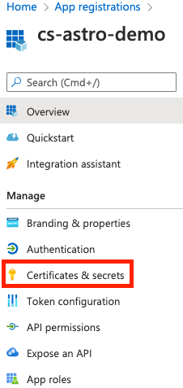

### Module - Azure Data Factory Connection + Operators

**Before you start**

- [ ]  Log in to Azure Portal
- [ ]  Have [an ADF pipeline](https://docs.microsoft.com/en-us/azure/data-factory/quickstart-create-data-factory-portal) in your Azure account

**Azure setup**

- [ ]  Search for “App registration”
- [ ]  Click on the app associated with your resource group. If you do not have one, first [create one](https://docs.microsoft.com/en-us/azure/active-directory/develop/howto-create-service-principal-portal#register-an-application-with-azure-ad-and-create-a-service-principal) by clicking on the “New registration” button
- [ ]  Save the “Application (client) ID”
- [ ]  Go to “Certificates & secrets” page

    

- [ ]  To create a new secret which will be used to connect Data Factory in Airflow, click on the “New client secret” button
- [ ]  Once you have a Client ID and Secret, you need to connect your API key to you Data Factory instance. To do so, go to your Data Factory (search for “Data factories”) and click “Access control (IAM)”
- [ ]  Once there, click on “Add role assignments” to add your Application (API) as a contributor to the Data Factory with the following settings:
- Role: Contributor
- Assign access to: User, group, or service principal
- Select: search for your app, add it to “Selected members” and click Save

**Create Azure Data Factory connection**

- [ ]  Create a connection in one of the following ways:
- Add [Azure Data Factory connection](https://airflow.apache.org/docs/apache-airflow-providers-microsoft-azure/stable/connections/adf.html) in your Dockerfile, a Secrets Backend, or via [Env Variables](https://docs.astronomer.io/astro/environment-variables)

```bash
export AIRFLOW_CONN_AZURE_DATA_FACTORY_DEFAULT="azure-data-factory://<your-client-id>:<your-secret>@/?extra__azure_data_factory__factory_name=<your-factory-name>&extra__azure_data_factory__resource_group_name=<your-resource-group-name>&extra__azure_data_factory__subscriptionId=<your-subscription-id>&extra__azure_data_factory__tenantId=<your-tenant-id>"
```

- **OR** Go to Admin > Connections in the Airflow UI, fill in following fields:
    - Connection Id: azure_data_factory_default
    - Connection Type: Azure Data Factory
    - Client ID: your app’s ID
    - Secret: your app’s secret
    - Factory Name: your factory
    - Resource Group Name: your resource group
    - Subscription ID: your [subscription ID](https://docs.microsoft.com/en-us/azure/azure-portal/get-subscription-tenant-id)
    - Tenant ID: your [tenant ID](https://www.notion.so/Astro-Data-Engineering-e60033fca30c4e618d3b8dc51b2ee8ab)

<aside>
💡 If you are running Airflow locally and chose the first way to create a connection, you’ll need to restart the project. You can restart your project using `astro dev restart`.

</aside>

**Add Astronomer to your Astro project**

- [ ]  Add `astronomer-providers[microsoft]` to your project’s `requirements.txt` file to use an async version of `AzureDataFactoryPipelineRunStatusSensor`

```bash
$ cat requirements.txt
astronomer-providers[microsoft]
```

<aside>
💡 If you are running Airflow locally, you’ll need to restart the project so that the Astronomer provider is installed. You can restart your project using `astro dev restart`.

</aside>

**Test Azure Data Factory operators**

- [ ]  Test Azure DF operators
- Create the following DAG (add `azure_data_factory.py` file to your `dags` directory):

```python
import pendulum
from datetime import timedelta

from airflow import DAG
from airflow.providers.microsoft.azure.operators.data_factory import AzureDataFactoryRunPipelineOperator
from astronomer.providers.microsoft.azure.sensors.data_factory import AzureDataFactoryPipelineRunStatusSensorAsync

# To be changed accordingly
DF_PIPELINE_NAME = "CopyPipeline"
AZURE_DF_CONN_ID = "azure_data_factory_default"

default_args = {
    "owner": "cs",
    "retries": 3,
    "retry_delay": timedelta(seconds=15),
    }

with DAG(
    dag_id="azure_data_factory",
    default_args=default_args,
    start_date=pendulum.datetime(2022, 8, 1, tz="UTC"),
    schedule=None,
    description="This DAG demonstrates how to interact with Azure Data Factory.",
    tags=["Azure", "Azure Data Factory"],
) as dag:

    run_df_pipeline = AzureDataFactoryRunPipelineOperator(
        task_id="run_df_pipeline",
        azure_data_factory_conn_id=AZURE_DF_CONN_ID,
        pipeline_name=DF_PIPELINE_NAME,
        wait_for_termination=False,  # Flag to wait on a pipeline run’s termination
    )

    wait_for_completion = AzureDataFactoryPipelineRunStatusSensorAsync(
        task_id="wait_for_completion",
        azure_data_factory_conn_id=AZURE_DF_CONN_ID,
        run_id=run_df_pipeline.output["run_id"],
        poll_interval=15,  # Polling period in seconds to check for the status
    )

    run_df_pipeline >> wait_for_completion
```

- Run it locally or deploy to Astro and hit the ▶️ `Trigger DAG` button to see a successful run
- [ ]  Go to Azure Portal to confirm that the end result of the pipeline looks as expected

**Extras / Reference**

- Reference


    ### Azure Data Factory

    - [Run Azure Data Factory pipelines with Airflow | Astronomer Tutorial](https://www.astronomer.io/guides/airflow-azure-data-factory-integration)
    - [Microsoft Azure Data Factory Connection | Airflow OSS Doc](https://airflow.apache.org/docs/apache-airflow-providers-microsoft-azure/stable/connections/adf.html)
    - [Using Airflow with Azure Data Factory | Astronomer Webinar](https://www.youtube.com/watch?v=9d_9S3-tcpg)
    - [AzureDataFactoryRunPipelineOperator | Astronomer Registry](https://registry.astronomer.io/providers/microsoft-azure/modules/azuredatafactoryrunpipelineoperator)
    - [AzureDataFactoryHook | Astronomer Registry](https://registry.astronomer.io/providers/microsoft-azure/modules/azuredatafactoryhook)
    - [AzureDataFactoryRunStatusSensor | Astronomer Registry](https://registry.astronomer.io/providers/microsoft-azure/modules/azuredatafactorypipelinerunstatussensor)
