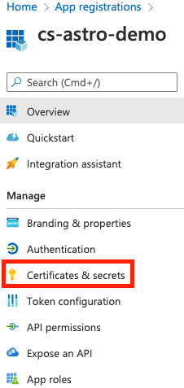

### Module - Azure Data Lake Connection + Operators

**Before you start**

- [ ]  Log in to Azure Portal
- [ ]  Have Azure Data Lake

**App registration**

<aside>
💡 You need to use [token credentials](https://docs.microsoft.com/en-us/azure/developer/python/azure-sdk-authenticate?tabs=cmd#authenticate-with-token-credentials) (i.e. add specific credentials - client_id, secret, tenant) and account name in order to create a connection in Airflow.
If you already have your app registered, skip to the next section.

</aside>

- [ ]  Search for “App registration”
- [ ]  Click on the app associated with your resource group. If you do not have one, first [create one](https://docs.microsoft.com/en-us/azure/active-directory/develop/howto-create-service-principal-portal#register-an-application-with-azure-ad-and-create-a-service-principal) by clicking on the “New registration” button
- [ ]  Save the “Application (client) ID”
- [ ]  Go to “Certificates & secrets” page

    

- [ ]  To create a new secret which will be used to connect Data Lake in Airflow, click on the “New client secret” button

**Create Azure Data Lake connection**

- [ ]  Create a connection in one of the following ways:
- Add [Azure Data Lake connection](https://airflow.apache.org/docs/apache-airflow-providers-microsoft-azure/stable/connections/adl.html) in your Dockerfile, a Secrets Backend, or via [Env Variables](https://docs.astronomer.io/astro/environment-variables)

```bash
export AIRFLOW_CONN_AZURE_DATA_LAKE_DEFAULT="azure-data-lake://<your-client-id>:<your-secret>@/?extra__azure_data_lake__account_name=<your-data-lake>&extra__azure_data_lake__tenant=<your-tenant-id>"
```

- **OR** Go to Admin > Connections in the Airflow UI, fill in following fields:
    - Connection Id: azure_data_lake_default
    - Connection Type: Azure Data Lake
    - Azure Client ID: your app’s ID
    - Azure Client Secret: your app’s secret
    - Azure DataLake Store Name: your data lake store’s name
    - Azure Tenant ID: your [tenant ID](https://www.notion.so/Astro-Data-Engineering-e60033fca30c4e618d3b8dc51b2ee8ab)

<aside>
💡 If you are running Airflow locally and chose the first way to create a connection, you’ll need to restart the project. You can restart your project using `astro dev restart`.

</aside>

**Test Azure Data Lake operators**

- [ ]  Test Azure DL operators
- Create the following DAG (add `azure_data_lake.py` file to your `dags` directory):

```python
from datetime import timedelta
import pendulum

from airflow import DAG
from airflow.decorators import task
from airflow.operators.empty import EmptyOperator
from airflow.providers.microsoft.azure.hooks.data_lake import AzureDataLakeHook
from airflow.providers.microsoft.azure.operators.adls_delete import AzureDataLakeStorageDeleteOperator

# To be changed accordingly
AZURE_DL_CONN_ID = "azure_data_lake_default"
DL_PATH = "source-files"
FILE_NAME = "new_file.txt"

default_args = {
    "owner": "cs",
    "retries": 3,
    "retry_delay": timedelta(seconds=15),
    }

with DAG(
    dag_id="azure_data_lake",
    default_args=default_args,
    start_date=pendulum.datetime(2022, 8, 1, tz="UTC"),
    schedule=None,
    description="This DAG demonstrates how to interact with Azure Data Lake.",
) as dag:

    @task
    def upload_new_file():
        import os

        hook = AzureDataLakeHook(azure_data_lake_conn_id=AZURE_DL_CONN_ID)
        new_file_path = f"include/{FILE_NAME}"
        with open(new_file_path, "w") as file:
            file.write("Hello there!")
        hook.upload_file(local_path=new_file_path, remote_path=f"{DL_PATH}/{FILE_NAME}")
        os.remove(f"include/{FILE_NAME}")

    @task
    def check_if_file_exists():
        hook = AzureDataLakeHook(azure_data_lake_conn_id=AZURE_DL_CONN_ID)
        return hook.check_for_file(f"{DL_PATH}/{FILE_NAME}")

    delete_file = AzureDataLakeStorageDeleteOperator(
        task_id="delete_file",
        azure_data_lake_conn_id=AZURE_DL_CONN_ID,
        path=f"{DL_PATH}/{FILE_NAME}",
        ignore_not_found=True,  # Whether to raise error if file to delete is not found
    )

    upload_new_file() >> check_if_file_exists() >> delete_file
```

- Run it locally or deploy to Astro and hit the ▶️ `Trigger DAG` button to see a successful run
- [ ]  Check the logs of ****`check_if_file_exists` task, you should see the following:

```python
{python.py:173} INFO - Done. Returned value was: True
```

**Extras / Reference**

- References


    ### Azure Data Lake

    [Microsoft Azure Data Lake Connection | Airflow OSS Doc](https://airflow.apache.org/docs/apache-airflow-providers-microsoft-azure/stable/connections/adl.html)

    [AzureDataLakeHook | Astronomer Registry](https://www.notion.so/Resource-Glossary-a45cce63a5c7468b922454fd937d4a5c)

    [AzureDataLakeStorageListOperator | Astronomer Registry](https://www.notion.so/Resource-Glossary-a45cce63a5c7468b922454fd937d4a5c)

    [AzureDataLakeStorageDeleteOperator | Astronomer Registry](https://www.notion.so/Resource-Glossary-a45cce63a5c7468b922454fd937d4a5c)

