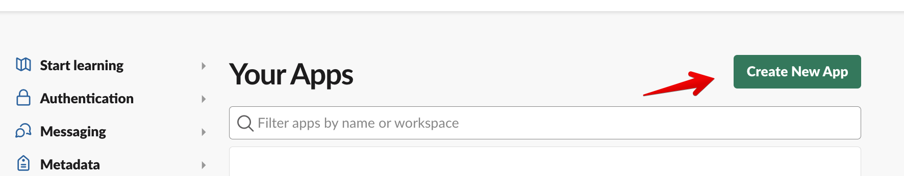

### Module - Airflow Callbacks & Notifications (Slack, Teams)

> A valuable component of logging and monitoring is the use of task [callbacks](https://airflow.apache.org/docs/apache-airflow/2.3.2/logging-monitoring/callbacks.html) to act upon changes in state of a given task, or across all tasks in a given DAG. For example, you may wish to alert when certain tasks have failed, or have the last task in your DAG invoke a callback when it succeeds.
>

<aside>
💡 Callback functions are only invoked when the task state changes due to execution by a worker. As such, task changes set by the command line interface ([CLI](https://airflow.apache.org/docs/apache-airflow/2.3.2/usage-cli.html)) or user interface ([UI](https://airflow.apache.org/docs/apache-airflow/2.3.2/ui.html)) do not execute callback functions.

Additionally, only **scheduled** tasks will be checked against SLA. For example, manually triggered runs will not invoke an SLA miss.

</aside>

<aside>
💡 Slack has a more advanced version that uses the `SlackAPIPostOperator` and the guide for creating a [token for the API (not the webhook) is here](https://api.slack.com/tutorials/tracks/getting-a-token)

</aside>

There are five types of task events that can trigger a callback:

- `on_success_callback`-Invoked when the task succeeds
- `on_failure_callback`-Invoked when the task fails
- `sla_miss_callback`-Invoked when a task misses its defined SLA
- `on_retry_callback`-Invoked when the task is up for retry
- `on_execute_callback`-Invoked right before the task begins executing.

**Before You Start**

- The Required steps may vary depending on the chosen method for receiving callbacks (e.g. Slack, MS Teams, PagerDuty, e-mail, etc.) ****In the following example, we will implement Slack callbacks.

**Add Dependencies to** `requirements.txt`:

- [ ]  Add the following packages to your `requirements.txt`:

```python
apache-airflow-providers-slack
apache-airflow-providers-http
```

- If your Astronomer project is already running, be sure to run `astro dev restart` to install these new packages.

**Configure Slack App & Webhook**

- [ ]  [Create a new Slack App](https://api.slack.com/apps), after clicking ‘Create New App’, select ‘From Scratch’:

    


- [ ]  Give your Slack App a name, and select the Slack Workspace in which you’d like to receive notifications

    <aside>
    ⚠️ Your workspace may require admin approval before being able to install it in your workspace.
    You can still proceed with the following steps and request approval after the App has been created and configured.

    </aside>


- [ ]  On the next page, select ‘Incoming Webhooks’, and then toggle this option to ‘On’:

    

    


- [ ]  Next, at the bottom of this same page, select ‘Add New Webhook to Workspace’. If you haven’t yet received Admin approval, this button will instead read ‘Request to Add New Webhook’:

    


- [ ]  Next, select the Workspace Channel(s) where you would like to receive the Airflow Notifications. For this example, start with a single channel:

    

    <aside>
    ⚠️ For each channel you add, you will receive a unique Webhook URL. This will correspond to creating a unique Airflow Connection for each individual Webhook URL, allowing you to receive notifications in multiple channels if desired.

    </aside>


- Once you have created a Webhook for a single channel, you will receive the Webhook URL. This is what we’ll use when creating the Airflow Connection. For example:

    ```python
    https://hooks.slack.com/services/T012345/B6789/C55555
    ```


**Create an Airflow Connection**

- [ ]  Create an Airflow Connection

    <aside>
    💡 The connection’s password value is found in the Webhook URL acquired in the previous step. It is the remainder of the URL after `[https://hooks.slack.com/services](https://hooks.slack.com/services)` , including the `/` after `services`. Using the webhook example URL from the previous step, the password would be: `/T012345/B6789/C55555`

    </aside>

- Option 1: Create connection directly in the Airflow UI
    - **Conn ID:** `slack_conn_id`
    - **Conn Type**: `HTTP`
    - **Host:** `https://hooks.slack.com/services`
    - **Password:** `/T012345/B6789/C55555`
- Option 2: Create connection as an Environment Variable

    ```python
    AIRFLOW_CONN_SLACK_CALLBACKS='{
        "conn_type": "http",
        "password": "/T012345/B6789/C55555",
        "host": "https://hooks.slack.com/services"
    }'
    ```


**Add an Example DAG and Callback Functions to your Astronomer project:**

- [ ]  Add an example callback DAG to your `/dags` directory, which will show an Airflow Callback in action:

    ```python
    import datetime
    from airflow import DAG
    from airflow.hooks.base import BaseHook
    from airflow.providers.slack.operators.slack_webhook import SlackWebhookOperator
    from airflow.operators.empty import EmptyOperator

    """
    Example DAG to showcase a callback in Airflow.
    """

    # Callback function example for on_success_callback using a conn_id "slack_callbacks"
    def success_callback_func(context):
        slack_conn_id = "slack_callbacks"
        slack_webhook_token = BaseHook.get_connection(slack_conn_id).password
        slack_msg = f"""
                :white_check_mark: Task has succeeded. 
                *Task*: {context.get('task_instance').task_id}  
                *DAG*: {context.get('task_instance').dag_id} 
                *Execution Time*: {context.get('execution_date')}  
                <{context.get("task_instance").log_url}| *Log URL*>
                """
        slack_alert = SlackWebhookOperator(
            task_id="slack_test",
            http_conn_id="slack_callbacks",
            webhook_token=slack_webhook_token,
            message=slack_msg,
            username="airflow",
        )
        return slack_alert.execute(context=context)

    with DAG(
            dag_id="slack_callback_example",
            start_date=datetime.datetime(2021, 1, 1),
            schedule="@once",
            catchup=False,
    ) as dag:

        # Example task showcasing the on_success_callback
        task_success_alert = EmptyOperator(
            task_id="task_success_alert",
            on_success_callback=success_callback_func,
        )

        task_success_alert
    ```


**Unpause and run the “slack_callback_example” DAG**

- [ ]  If your DAG and connection have been configured properly, you will begin receiving Slack notifications in the channel which you created a Webhook URL for. They will look similar to this:

    


**Checkpoint**

You have now successfully implemented a Slack Callback in your Example DAG.

**Next Steps**

- Add more functions for the other available callback alerts
- Customize the contents of your notifications in the callback functions as needed
- Split your callback functions out into a separate file in the `/include` directory so they can be easily imported into any DAG, and only need to be edited in one place (rather than in each individual DAG)
    - i.e:

        ```python
        from include import slack_callback_functions
        ```


- You can set callbacks at the DAG-level (applying them to *all* tasks) by setting them in the `default_args` dictionary:

    ```python
    default_args = {
        # Callbacks set in default_args will apply to all tasks unless overridden at the task-level
        "on_success_callback": success_callback_func,
        "on_failure_callback": failure_callback_func,
        "on_retry_callback": retry_callback_func
    }
    ```

- To override or turn off notifications for specific tasks, you can also set callbacks at the task-level:

    ```python
        slack_test_func = PythonOperator(
            task_id="slack_test_func",
            python_callable=_my_function,
            **on_success_callback=None,**
        )
    ```


- If you’d to receive notifications in **multiple** Slack channels, use this [Example DAG](https://github.com/astronomer/cs-tutorial-slack-callbacks/blob/main/dags/slack_callback_partial_dag.py) and these [Callback Functions](https://github.com/astronomer/cs-tutorial-slack-callbacks/blob/main/include/slack_callback_functions_with_partial.py) instead of those provided in previous steps. Note in this DAG how the `partial` module is used to specify channel-specific Airflow Connections when setting the callback.

- For identical instructions for setting up **MS Teams Callbacks**, see [this repository](https://github.com/astronomer/cs-tutorial-msteams-callbacks) which includes [Example DAGs](https://github.com/astronomer/cs-tutorial-msteams-callbacks/tree/main/dags), [functions](https://github.com/astronomer/cs-tutorial-msteams-callbacks/tree/main/include), and [instructions](https://github.com/astronomer/cs-tutorial-msteams-callbacks/blob/main/README.md) for setting up the Teams webhooks.

    <aside>
    ⚠️ The MS Teams Callback integration also requires adding a [hook and operator](https://github.com/astronomer/cs-tutorial-msteams-callbacks/tree/main/include) which can be found in the `/include` directory.

    </aside>


- **Extras / Reference**
    - [single channel slack alerts](https://registry.astronomer.io/dags/slack-callback-dag)
    - [multiple channel slack alerts](https://registry.astronomer.io/dags/slack-callback-partial-dag)

    - [Callbacks | Apache Docs](https://airflow.apache.org/docs/apache-airflow/2.3.2/logging-monitoring/callbacks.html)
    - [Error Notifications in Airflow | Astronomer Guide](https://www.astronomer.io/guides/error-notifications-in-airflow)
    - [Monitor your DAGs with Airflow Notifications | Astronomer Webinar](https://www.astronomer.io/events/webinars/dags-with-airflow-notifications)
    - [MS Teams Callbacks | GitHub Repo](https://github.com/astronomer/cs-tutorial-msteams-callbacks)
    - [Slack Callbacks | GitHub Repo](https://github.com/astronomer/cs-tutorial-slack-callbacks)
    - [Appendix Section for creating MS Teams & Slack Webhooks | Google Slides](https://docs.google.com/presentation/d/1lnu3IfM82I09yK7XuzGcroDNMlZpqs-3nARDCWpfaDI/edit?usp=sharing)
